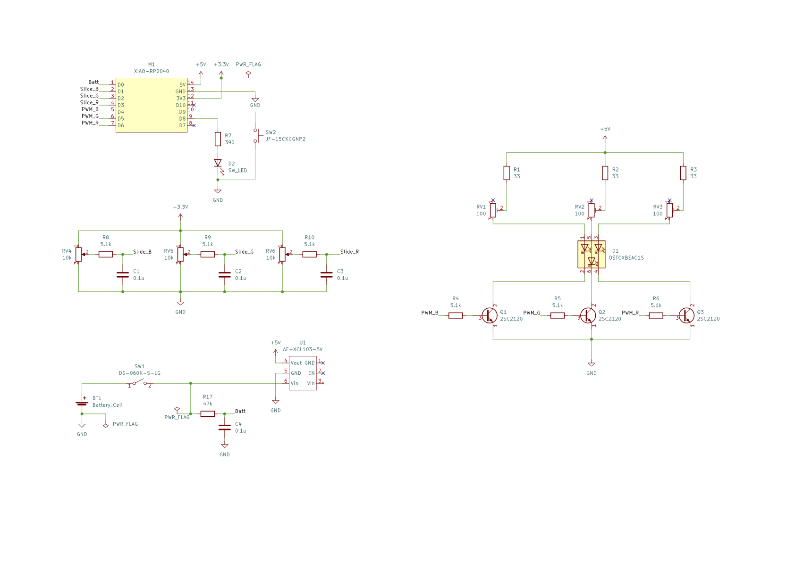

# RGB_Mixer

<image src="images/RGB_Mixer.jpeg" alt="完成写真" height=200>

光の3原色を体感するために作成したデバイスです。
赤青緑のスライダを動かしてさまざまな色を作ったり、デモモードでは自動的に色を変えて表示したりできます。

ここでは作り方を説明します。
設計時に考慮したことや内容についてはハードウェア・ソフトウェアの設計と内容について(作成中)をご覧ください。

## 回路の製作

回路図は下の通りです。[こちら](RGB_Mixer_Schematic.pdf)からPDFもダウンロードできます。

回路図中のD2は電源スイッチ(SW1)内蔵のLEDです。

### 部品の入手

電気関係の部品はすべて秋葉原の秋月電子や千石電商、マルツなどで入手できます。
抵抗などは仕様が同等であれば、表の通りでなくても構いません。

LEDにかぶせるカバーは紙コップなどでも代用できます。

この他にハンダゴテやハンダ、ニッパーなどの工具が必要です。

| リファレンス | 名称 | 型番 | 購入先 | 備考 |
|---|---|---|---|---|
| U1 | DCDCコンバータ | AE-XCL103-5V0 | 秋月電子 | |
| D1 | 3色LED | OSTCXBEAC1S | 秋月電子 | |
| RV4, 5, 6 | スライドボリューム | RS45111-OC10-CO-PO-B103 | 千石電商 | |
| R1〜7 | 抵抗 | | | 1/4W品 |
| RV1, 2, 3 | 半固定抵抗 | 3362P 100Ω | 秋月電子 | |
| M1 | マイコンボード | Seeed Xiao RP2040 | 秋月電子など | |
| SW1(D2) | 電源スイッチ | DS-060K-S-LG | 千石電商など | |
| SW2 | モード切替スイッチ | JF-15CKCGNP2 | マルツ | モーメンタリなら可 |
| Q1, 2, 3 | トランジスタ | 2SC2120 | 秋月電子 | |
| C1〜4 | 抵抗 | 積層セラミックコンデンサ | | |
| | ユニバーサル基板 | | 秋月電子など | |
| | ケース | PF20-4-13W | マルツ | |
| | 電池ボックス | BC3-2L-W | マルツ | |
| | スライドボリュームつまみ | fader-mk2-red | 千石電商 | blueとgreenも |
| | LEDカバー | ポンポンライト | ダイソー | その他の形状もあり |

URLは以下となります。

* AE-XCL103-5V0: https://akizukidenshi.com/catalog/g/gK-15097/
* OSTCXBEAC1S: https://akizukidenshi.com/catalog/g/gI-13755/
* RS45111-OC10-CO-PO-B103: https://www.sengoku.co.jp/mod/sgk_cart/detail.php?code=EEHD-4HS6
* 3362P 100Ω: https://akizukidenshi.com/catalog/g/gP-03267/
* Seeed Xiao RP2040: https://akizukidenshi.com/catalog/g/gM-17044/
* DS-060K-S-LG:  https://www.sengoku.co.jp/mod/sgk_cart/detail.php?code=EEHD-5CHE
* JF-15CKCGNP2: https://www.marutsu.co.jp/GoodsDetail.jsp?q=JF-15CKCGNP2&salesGoodsCode=15724&shopNo=3
* 2SC2120: https://akizukidenshi.com/catalog/g/gI-13829/
* PF20-4-13W:  https://www.marutsu.co.jp/pc/i/515753/
* BC3-2L-W: https://www.marutsu.co.jp/pc/i/2236794/
* fader-mk2-red: https://www.sengoku.co.jp/mod/sgk_cart/detail.php?code=EEHD-5KM5
* ポンポンライト: https://jp.daisonet.com/products/4549131971408?_pos=2&_sid=26a631bf3&_ss=r

### 製作

回路図に従って作成しますが、この段階では`PWM_R`、`PWM_G`、`PWM_B`はまだマイコンM1には接続しないでおいてください。
色の調整が終わってから接続します。

電源スイッチ、モード切替スイッチ、スライドボリュームも仮配線の方がよいでしょう。
配線してしまうとケース加工が

## 色の調整

明るさや色味の調整をします。
人の目は緑色を強く感じるため、先に緑色で全体の明るさを調整します。

1. LEDにカバーをかぶせます
1. `RV1`から`RV3`のダイアルを一番左に回しておきます
1. `PWM_G`に3.3Vの電圧かかかるようにしておきます
1. 電池ボックスに電池を入れ、電源スイッチをオンにします
1. `RV2`をゆっくり右へ回し、最大の明るさを決めます
1. `PWM_R`にも3.3Vの電圧をかけます
1. `RV3`を右へ回し、きれいな黄色になるようにします  
一番右にしても緑色っぽいときには、`RV2`を左に回して緑色を弱めます
1. `PWM_B`にも3.3Vの電圧をかけます
1. `RV1`を右に回し、白色になるようにします

これで調整は完了です。`PWM_R`などをマイコンへ配線します。

<image src="images/Test1.jpeg" alt="テストの様子1" height=200>
<image src="images/Test2.jpeg" alt="テストの様子2" height=200>

## ソフトウェアのインストール

CircuitPythonというプログラム言語を使っており、CircuitPythonのインストールとソフトウェアのコピーの順で作業します。

### CircuitPythonのインストール

[こちらのサイト](https://wiki.seeedstudio.com/XIAO-RP2040-with-CircuitPython/)の`Installation`の手順とほぼ同じです。

1. [CircuitPythonのサイト](https://circuitpython.org/board/seeeduino_xiao_rp2040/)から`UF2`ファイルをダウンロードします
1. XIAO RP2040の'BOOT'ボタンを押しながら、パソコンとUSBケーブルで接続します。  
接続したらBOOTボタンは放して大丈夫です
1. パソコンから`RP1-RP2`というディスクとして見えるようになります
1. `RP1-RP2`にUF2ファイルをコピーします
1. 少し待つと`RP1-RP2`が消え、`CIRCUITPY`というドライブが出てきます

### ソフトウェアのコピー

1. [CircuitPythonのサイト](https://circuitpython.org/libraries)の`Bundle for Version 8.x`のzipファイルをダウンロードします
1. ダウンロードしたzipファイルを展開します。`adafruit-circuitpython-bundle-8.x-mpy-xxxxxxx`のようなフォルダができます
1. [`firmware`フォルダ](https://github.com/ssstaka/RGB_Mixer/tree/main/firmware)の`code.py`と`hsl_rgb.py`をダウンロードします
1. `CIRCUITPY`に`code.py`と`hsl_rgb.py`をコピーします
1. `CIRCUITPY`に`lib`というフォルダを作成し、Bundleを展開した中にある`asyncio`フォルダをコピーします

この段階で全体を動かしてみて以下を確認するとよいでしょう。

* デモモードで色が連続的に変化する
* モード切替スイッチでデモモードと手動モードが切り替わる

## ケース収納

スイッチやボリュームなどの穴を開けて取り付けていきます。

* モード切替スイッチは本来はケース取り付け用ではないため、配線を通す穴を開けてエポキシ接着剤で固定しました
* ポンポンライト底面の基板は取り除きます
* LEDはケース上面に両面テープで固定しました
* ボリュームとつまみは幅が少し異なり、そのままだと外れやすいです。  
ボリュームの軸を削って少し薄くし、エポキシ接着剤で固定しました

<image src="images/Assembled.jpeg" alt="ケース収納した状態" height=200>

完成です！